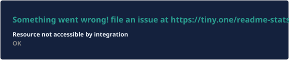

<div align="center">


### M.Sc. Computer Science · Saarland University & CISPA  
**Trustworthy AI · LLM Safety · Research Software Engineering**

[](https://scholar.google.com/citations?user=lIKXH1AAAAAJ)
[](https://arxiv.org/search/cs?query=au%3A%22Abdul+Rafay+Syed%22&searchtype=author)
[](mailto:rafay7381@gmail.com)

<br/>


</div>

---

## About me

I recently completed my **M.Sc. in Computer Science** at **Saarland University**, with thesis research at **[CISPA Helmholtz Center for Information Security](https://cispa.de)**.

I build and evaluate **LLM systems under real deployment conditions**, from activation-space safety diagnostics to large-scale agentic pipelines, with a focus on whether model-internal signals and evaluation metrics are **specific enough to trust**.

**Currently interested in**
- Uncertainty quantification & trustworthy LLM evaluation  
- Research software / open ML platforms (APIs, harnesses, reproducible pipelines)  
- Mechanistic interpretability for safety auditing
- Trustworthy Computing

---

## Research highlights

<table>
<tr>
<td width="50%" valign="top">

### Activation directions for emergent misalignment
**arXiv:2606.20225** · single-author preprint  

Across four LLM families, within-model difference-in-means directions are **causally specific and actionable** (**99.6%** separability, **21–51** pt steering). Cross-model transfer is causally real but **non-specific** under controls.

[Read PDF](https://arxiv.org/pdf/2606.20225)

</td>
<td width="50%" valign="top">

### QuestSecure · WITS 2024
**arXiv:2412.13988** · peer-reviewed  

RAG system for IT / supply-chain security questionnaires (similarity + MMR retrieval, LLAMA/Mistral). Best config: METEOR **0.114→0.139**, BERTScore F1 **0.643→0.692**.

[Read on arXiv](https://arxiv.org/abs/2412.13988)

</td>
</tr>
</table>

---

## Tech stack

<div align="center">

### Languages & core


### ML & research


### Systems & apps


<br/>

`Hugging Face` · `PEFT / QLoRA` · `LangChain` · `Elasticsearch` · `Inspect`

</div>

---

## GitHub analytics

<!-- Static SVGs generated by .github/workflows/update-stats.yml (no Vercel). -->

<div align="center">




<br/>


</div>

---

## Snapshot

```text
📍 Saarbrücken, Germany
🎓 M.Sc. CS (graduated) — Saarland University
🔬 Thesis research — CISPA Helmholtz Center for Information Security
🎯 Looking for — PhD / research engineer roles in trustworthy AI & ML platforms as well as research collaborations
```

---

<div align="center">


**Open to research collaborations and PhD opportunities**  
[Scholar](https://scholar.google.com/citations?user=lIKXH1AAAAAJ) · [Email](mailto:rafay7381@gmail.com)

</div>
